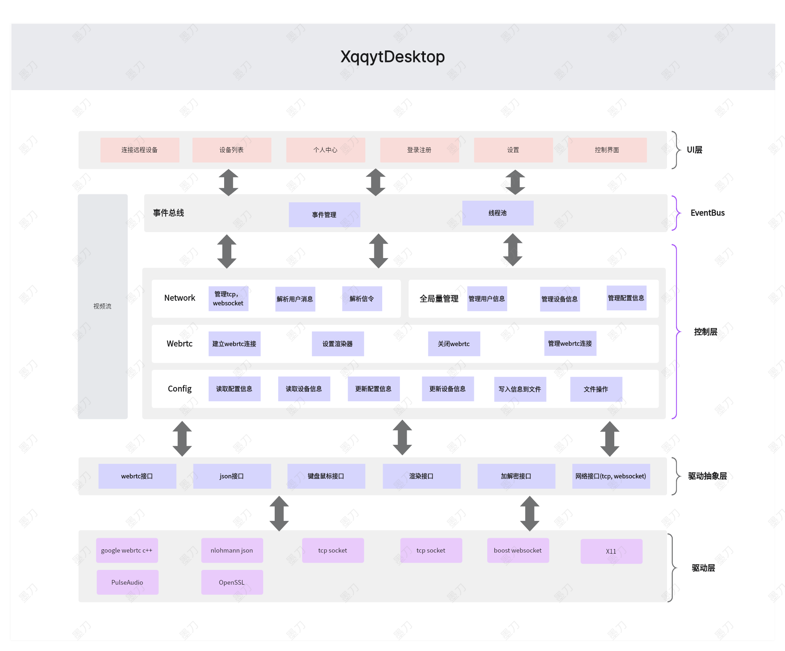

# 开发文档

### 项目架构图

### 编译&&构建环境

系统环境： Ubuntu 24.04
编译工具： g++
构建工具： cmake

该项目不支持跨平台，目前仅支持Linux
### 适配情况

桌面：
- Xorg

音频：
- Pulse

#### 版本规划

| 版本号 | 版本内容 |
|--------|--------|
| v1.0.0  | 支持远控  |
| v2.0.0  | 增加用户功能  |
| v3.0.0  | 增加文件传输|
| v4.0.0  | 增加消息聊天|
| v5.0.0  | 增加ssh支持|

[版本发布](../CHANGELOG.md)

